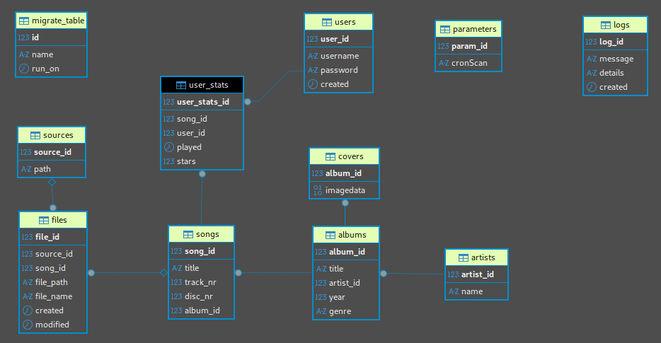

# reimagined-disco-db
Migrations for the reimagined-disco database

# er schema


# help
`node app.js` will print an help message

# db start

```
POSTGRES_PASSWORD=$(echo ./private/db-passwd)
docker run --rm --name reimagined-disco-db  \
  -p 5432:5432                              \
  -v /home/steo/pgData:/var/lib/postgresql/data  \
  -e POSTGRES_PASSWORD=$POSTGRES_PASSWORD   \
  -e POSTGRES_USER=reimagineddisco          \
  -e POSTGRES_DB=reimagineddisco            \
  -d                                        \
    postgres:14
docker logs -f reimagined-disco-db
```
or under Windows:
```
SET /p POSTGRES_PASSWORD=< .\private\db-passwd
docker run --rm --name reimagined-disco-db  ^
  -p 5432:5432                              ^
  -v D:\steo\pgData:/var/lib/postgresql/data  ^
  -e POSTGRES_PASSWORD=%POSTGRES_PASSWORD%  ^
  -e POSTGRES_USER=reimagineddisco          ^
  -e POSTGRES_DB=reimagineddisco            ^
  -d                                        ^
    postgres:14
docker logs -f reimagined-disco-db
```

# db stop
```
docker stop reimagined-disco-db
```

Cleanup (if needed):
```
docker rm reimagined-disco-db
```

# using a client

```
docker run --rm -it --name cloudbeaver              \
  -p 8888:8978                                      \
  -v $HOME\dbeaverData:/opt/cloudbeaver/workspace   \
    dbeaver/cloudbeaver:latest
```